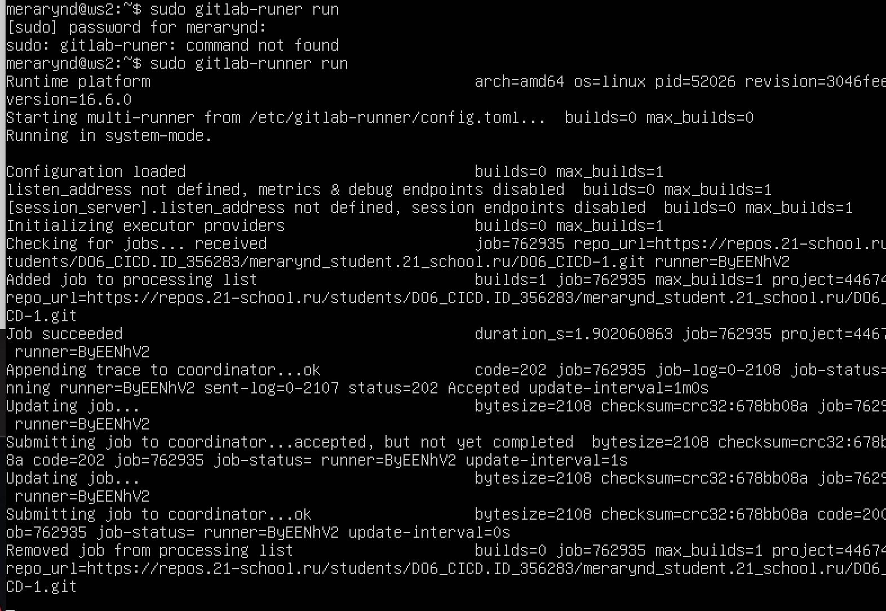
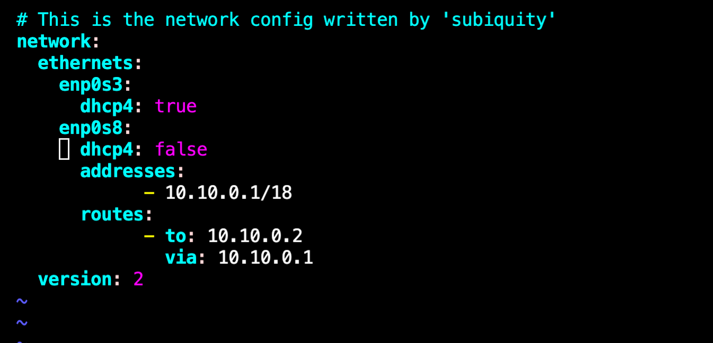

### Part 1. Настройка **gitlab-runner**

**== Задание ==**

##### Поднять виртуальную машину *Ubuntu Server 20.04 LTS*

   

##### Скачать и установить на виртуальную машину **gitlab-runner**

Получаем ошибку 0000, которая показана на следующем скриншоте и переустаналиваем gitlab-runner с использованием команд:

*-sudo curl -L --output /usr/local/bin/gitlab-runner "https://gitlab-runner-downloads.s3.amazonaws.com/latest/binaries/gitlab-runner-linux-amd64"*

*-sudo chmod +x /usr/local/bin/gitlab-runner*

*-sudo useradd --comment 'GitLab Runner' --create-home gitlab-runner --shell /bin/bash*

*-sudo gitlab-runner install --user=gitlab-runner --working-directory=/home/gitlab-runner*

*-sudo gitlab-runner start*

*-sudo systemctl enable --now gitlab-runner*

##### Запустить **gitlab-runner** и зарегистрировать его для использования в текущем проекте (*DO6_CICD*)
- Для регистрации понадобятся URL и токен, которые можно получить на страничке задания на платформе.

 

Запускаем "gitlab-runner" командой **sudo gitlab-runner run** дабы проверить работоспособность.

 Проверяем активировался ли gitlab-runner командой :

 *-sudo systemctl status gitlab-runner*

### Part 2. Сборка

**== Задание ==**

#### Написать этап для **CI** по сборке приложений из проекта *C2_SimpleBashUtils*:

##### В файле _gitlab-ci.yml_ добавить этап запуска сборки через мейк файл из проекта _C2_

##### Файлы, полученные после сборки (артефакты), сохранять в произвольную директорию со сроком хранения 30 дней.

Пушим и проверяем работу на GitLab:

### Part 3. Тест кодстайла

**== Задание ==**

#### Написать этап для **CI**, который запускает скрипт кодстайла (*clang-format*):

Докачиваем на gitlab-runner с помощью команды *sudo apt-get install -y clang-format* clang-format:

##### Если кодстайл не прошел, то "зафейлить" пайплайн

##### В пайплайне отобразить вывод утилиты *clang-format*

### Part 4. Интеграционные тесты

**== Задание ==**

#### Написать этап для **CI**, который запускает ваши интеграционные тесты из того же проекта:

##### Запускать этот этап автоматически только при условии, если сборка и тест кодстайла прошли успешно

##### Если тесты не прошли, то "зафейлить" пайплайн

##### В пайплайне отобразить вывод, что интеграционные тесты успешно прошли / провалились

### Part 5. Этап деплоя

**== Задание ==**

##### Поднять вторую виртуальную машину *Ubuntu Server 20.04 LTS*

Изменяем *00-installer-config.yaml* на первой машине.  

Изменяем *00-installer-config.yaml* на второй машине.

Применяем изменения в обеих машинах *sudo netplan apply*, пробрасываем порты. Пропингуем их между собой.

Пингуем первую машину с второй. 

Создаём bash-скрипт *script.sh*, который при помощи *ssh* и 8scp* копирует файлы, полученные после сборки (артефакты), в директорию */usr/local/bin* второй виртуальной машины.
`SSH` - протокол сетевой связи, используемый для безопасного удаленного управления компьютерами и передачи данных через небезопасные сети, такие как Интернет.
`SCP` расшифровывается как "Secure Copy" (безопасная копия) и является командой в UNIX-подобных операционных системах, предназначенной для копирования файлов и директорий между компьютерами через сетевое соединение, используя протокол SSH для обеспечения безопасности передачи данных.
`SCP` позволяет копировать файлы с одного удаленного хоста на другой удаленный хост, либо с удаленного хоста на локальную машину, и наоборот. Он использует SSH для аутентификации и шифрования данных во время передачи, обеспечивая безопасную передачу файлов по сети.

#### Написать этап для **CD**, который "разворачивает" проект на другой виртуальной машине:

Заходим в пользователя gitlab-runner используя команду *sudo su - gitlab-runner*.
Генерируем ssh-ключ командой *ssh-keygen -t rsa*.
Копируем ключ на другую машину командой *ssh-copy-id -p 2022 merarynd@10.10.0.2*.
Проверяем, заходим в другую в вторую машину из первой без запроса пароля.

##### Запускать этот этап вручную при условии, что все предыдущие этапы прошли успешно

##### В файле _gitlab-ci.yml_ добавить этап запуска написанного скрипта

##### В случае ошибки "зафейлить" пайплайн

### Part 6. Дополнительно. Уведомления

**== Задание ==**

##### Настроить уведомления о успешном/неуспешном выполнении пайплайна через бота с именем "[ваш nickname] DO6 CI/CD" в *Telegram*

Добавляем в файл `.gitlab-ci.yml` несколько строк в конец каждой стадии. А именно строки `after_script` и действие, которое должно совершиться в конце стадии.   
Когда задачи в конкретном этапе выполняются успешно или с ошибками, блок `after_script` позволяет определить команды или скрипты, которые должны быть выполнены независимо от результата предыдущих задач в этом этапе. Обычно это используется для выполнения некоторых очисточных действий или финальных операций после завершения всех задач в этапе.

Создаём бота, пишем в телеграмме BotFather. Затем выполняем действия, которые нам предлогает бот. После чего он даст токен нашего бота. Переходим по ссылке в конце сообщения и запускаем его.

Пушим изменения и проверяем работу пайплайна. Всё прошло успешно.

По завершении каждой из стадий приходят сообщения в телеграм.

Таким образом получаем бота который показывает уведомления о завершении каждой из задач. Спасибо за просмотр!